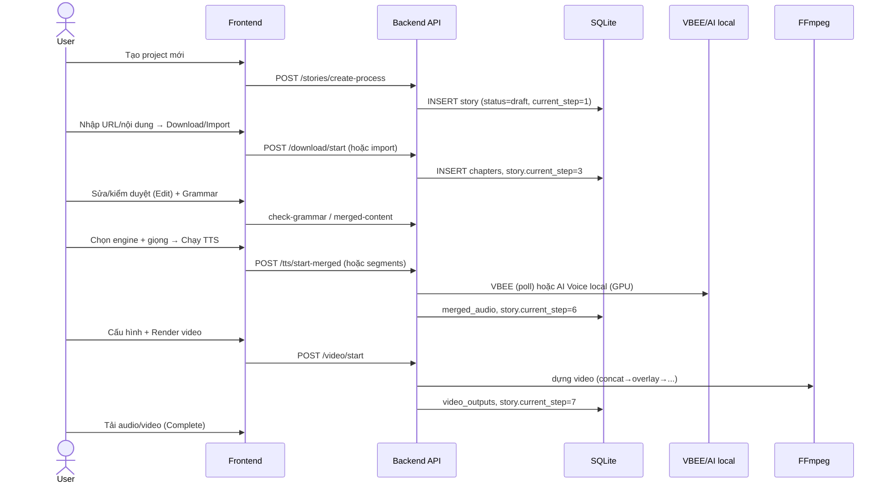
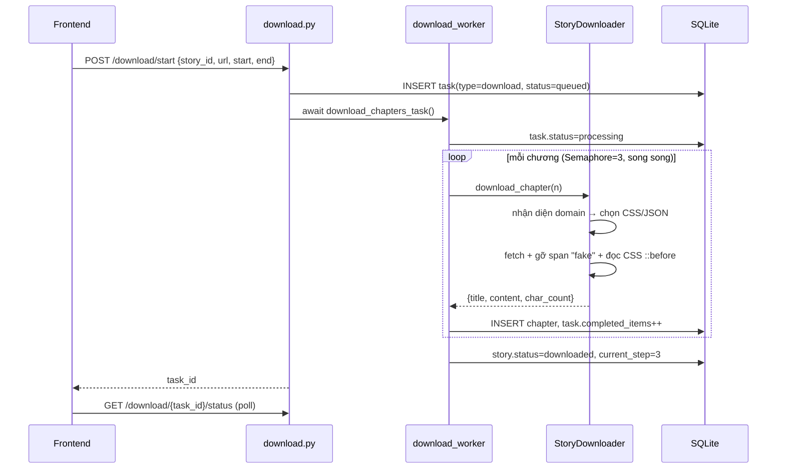
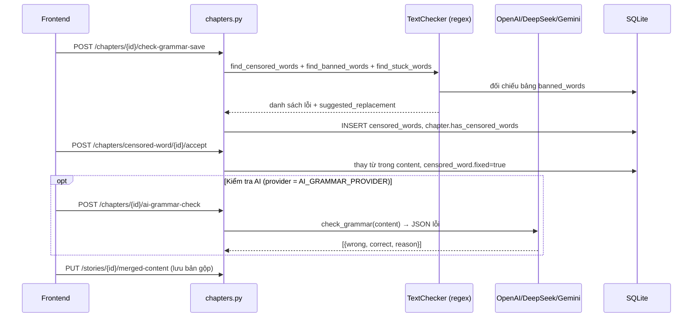
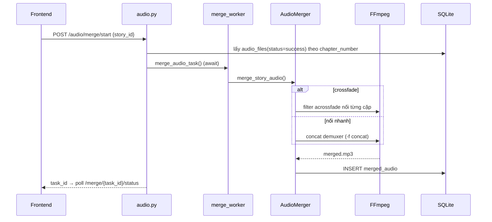
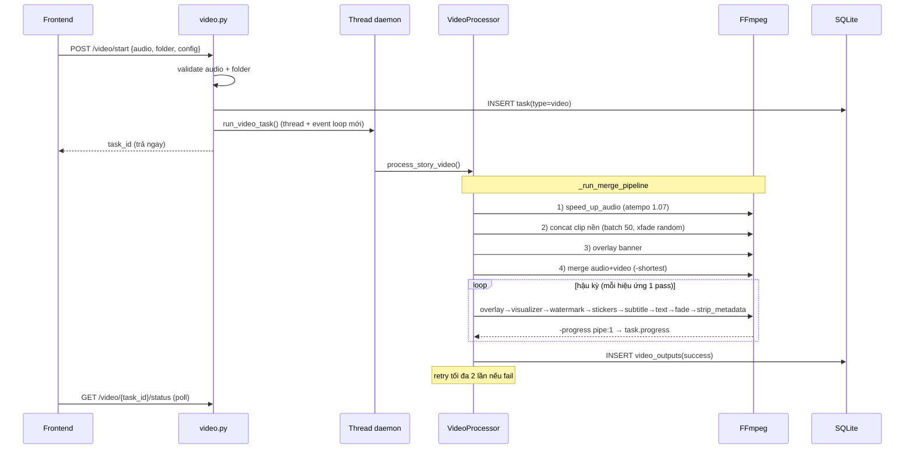
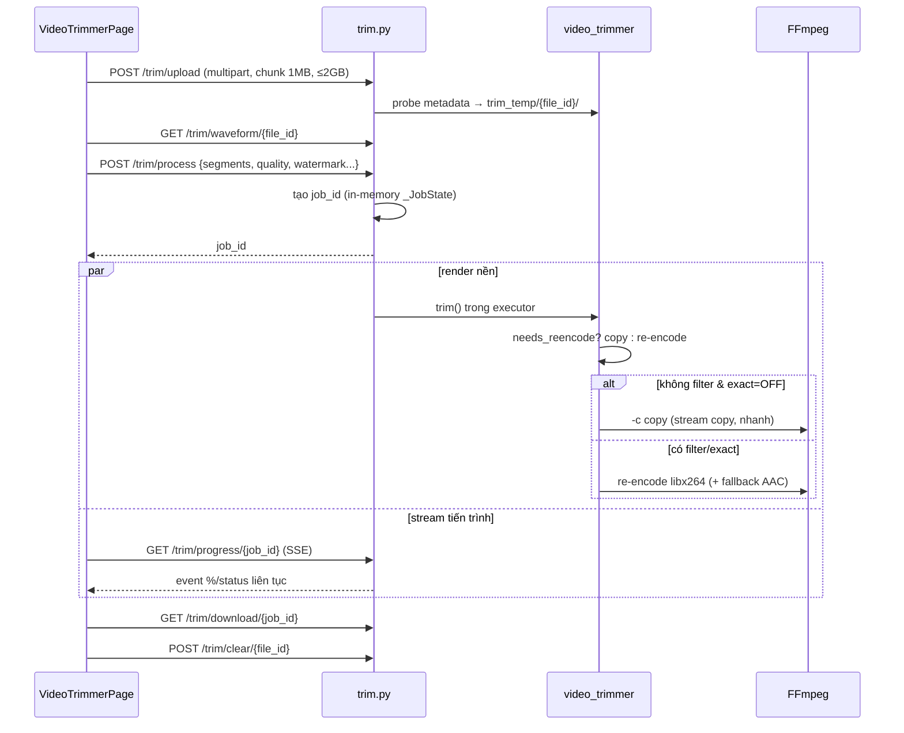
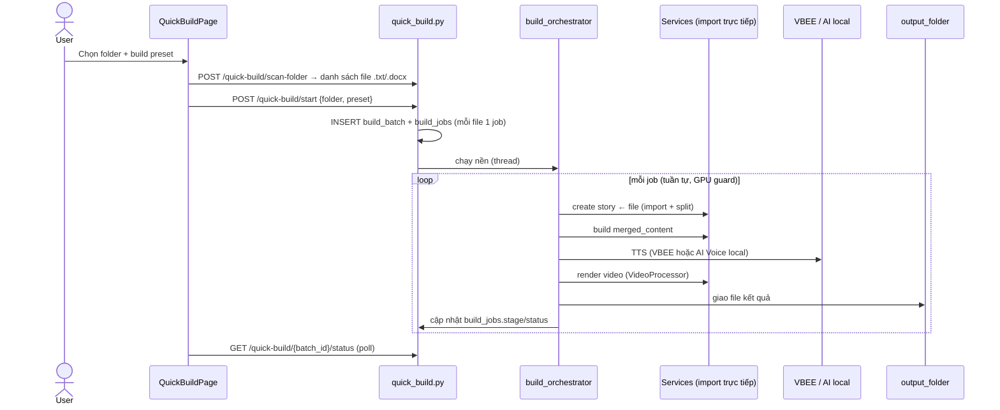

# 📚 Tài liệu dự án — TruyenFull Processor

> Tài liệu tổng hợp: kiến trúc, stack công nghệ, luồng nghiệp vụ (flow) và chi tiết từng chức năng.
> Cập nhật: 2026-08-08.

---

## 1. Tổng quan

**TruyenFull Processor** là một ứng dụng biến **truyện chữ thành audiobook và video**. Nó không "chỉ chạy web" — giao diện chỉ là bảng điều khiển; phần lõi là một **pipeline xử lý media** nhiều bước.

Luồng giá trị cốt lõi:

```
Nạp truyện (tải từ web / dán / upload)  →  Sửa & kiểm duyệt văn bản  →  Kiểm tra ngữ pháp AI
   →  TTS (giọng đọc)  →  Ghép audio  →  Render video có phụ đề  →  Xuất file
```

Ứng dụng được đóng gói và vận hành theo **các cách sau**:

| Cách | Mô tả | Khi nào dùng |
|------|-------|--------------|
| **Desktop app (.exe)** | Cài `Setup.exe`, chạy 1 cửa sổ (WebView2 + FastAPI nền, SQLite) — không cần Docker/Python/Node/FFmpeg | Người dùng cuối |
| **Web dev mode** | Chạy backend (uvicorn) + frontend (Vite) khi phát triển | Lập trình viên |
| **Quick Build** (trong app) | Chọn 1 folder chứa file truyện `.txt/.docx` → build hàng loạt ra video theo preset | Tự động hóa nhiều truyện một lượt |
| **Wizard 8 bước** (trong app) | Làm thủ công từng bước, kiểm soát từng chương | Làm chi tiết, tinh chỉnh |

> ⚠️ **Lưu ý lịch sử:** các bản tài liệu cũ mô tả một script `auto_run.py` (Batch CLI) và database **MySQL trong Docker**. Cả hai đã bị **loại bỏ** — dự án đã chuyển sang **desktop SQLite** và tính năng **Quick Build** thay cho `auto_run.py`.

---

## 2. Kiến trúc & Stack công nghệ

```
┌─────────────────────────────────────────────────────────────────┐
│  Frontend — React + TS + Vite + Tailwind                        │
│  Dev: Vite :5173 (proxy /api → :8000)                           │
│  Desktop: FastAPI serve dist/ same-origin trong WebView2         │
└───────────────────────────┬─────────────────────────────────────┘
                            │ HTTP (axios / SSE)
┌───────────────────────────▼─────────────────────────────────────┐
│  Backend — FastAPI + SQLAlchemy 2.0                             │
│  api/ (routers) ── services/ (logic) ── workers/ (nền)          │
│  license gate (Ed25519) chặn mọi /api/v1/* khi chưa kích hoạt   │
│      │ FFmpeg / ffprobe (subprocess)  │ HTTP APIs               │
└──────┼───────────────────────────────┼──────────────────────────┘
       │                               │
┌──────▼──────┐          ┌─────────────▼──────────────────────────┐
│  SQLite     │          │ VBEE TTS (cloud) · AI Voice local (GPU) │
│ (app.db,    │          │ Gemini · OpenAI · DeepSeek              │
│  per-user)  │          │ Storefront license server              │
└─────────────┘          └────────────────────────────────────────┘
```

### 2.1. Frontend

| Thành phần | Công nghệ |
|------------|-----------|
| Framework | React 18.2 + TypeScript 5.3 |
| Build tool | Vite 5.1 (`@vitejs/plugin-react`) |
| Routing | `react-router-dom` 6.21 |
| HTTP | `axios` 1.6 + SSE (`EventSource`) cho tiến trình cắt video |
| State | `zustand` 4.5 (có cài; phần lớn page dùng `useState` cục bộ) |
| UI | Tailwind CSS + `lucide-react` (icon) + `clsx`; **tự viết component**, không dùng thư viện UI |
| Cầu nối desktop | `services/nativeDialog.ts` gọi `window.pywebview.api` để mở hộp thoại chọn file/thư mục native (Quick Build) |

### 2.2. Backend

| Thành phần | Công nghệ |
|------------|-----------|
| Web framework | FastAPI 0.109 + Uvicorn 0.27 |
| ORM / DB driver | SQLAlchemy 2.0 + **sqlite3 (stdlib)** — không cần driver ngoài. MySQL (PyMySQL) chỉ là nhánh legacy khi override `DATABASE_URL` |
| Validation / config | Pydantic 2.5 + pydantic-settings |
| Scraping | `requests` + `beautifulsoup4` + `chardet` |
| Xử lý media | **FFmpeg / ffprobe CLI** (gọi qua `subprocess`) — tự dò **NVENC** (GPU), fallback libx264 |
| Ảnh | **Pillow** (tạo mask hình cho watermark) |
| TTS local | **torch (cu124)** + model neural embed (chỉ có trong bản build full) |
| Bảo mật giấy phép | `cryptography` (Ed25519) — xác thực offline license token |
| Đóng gói desktop | `pywebview` + `pythonnet` (WebView2) |
| Xuất tài liệu | `python-docx` |
| Logging | `loguru` (ghi `logs/app.log` trong data dir, xoay vòng 10 MB) |

> ⚠️ **FFmpeg binary** không nằm trong `requirements.txt` — bản dev cần đặt `ffmpeg.exe`/`ffprobe.exe` vào `backend/bin/` hoặc cài trên PATH; bản desktop **bundle sẵn** trong `_internal/bin/`.
> Có 2 file phụ thuộc: `requirements.txt` (bản thường, VBEE-only) và `requirements.lock.txt` (bản build full, có torch cu124 cho AI Voice local).

### 2.3. Database & Hạ tầng

| Thành phần | Chi tiết |
|------------|----------|
| DB mặc định | **SQLite** — file `app.db` trong thư mục dữ liệu per-user (`app/paths.py`). Không cần cài gì |
| PRAGMA | `journal_mode=WAL`, `foreign_keys=ON` (bật cascade delete), `busy_timeout=30000`, `synchronous=NORMAL` (`database.py:25-32`) |
| Khởi tạo | `init_db()` (`main.py:109`) tự `create_all` + vá cột thiếu; migration chạy **tự động** mỗi lần khởi động (`db_migrations`, `preset_migration`) — **không còn chạy tay** |
| Seed dữ liệu | `app/seed.py` nạp **25 giọng VBEE** + **9 settings** mặc định khi DB rỗng (thay cho SQL init của Docker cũ). Bản đóng gói còn chép sẵn `default_seed.db` (reference: từ kiểm duyệt + prompt) |
| MySQL (legacy) | Vẫn còn nhánh code nếu ai đó set `DATABASE_URL=mysql+pymysql://...`, nhưng **driver không được cài** trong `requirements.txt` — cần tự cài |

### 2.4. Tích hợp bên ngoài

| Dịch vụ | Vai trò | Cấu hình |
|---------|---------|----------|
| **VBEE TTS** | Chuyển văn bản → giọng đọc (engine cloud, mặc định) | `VBEE_APP_ID`, `VBEE_BEARER_TOKEN` |
| **AI Voice local** | TTS neural chạy **local trên GPU** (fallback CPU), hỗ trợ voice clone/design; tự tắt nếu thiếu torch/CUDA/model | `AIVOICE_LOCAL_*` (xem mục 8) |
| **Google Gemini** | Kiểm tra ngữ pháp / cải thiện văn bản bằng AI | `GEMINI_API_KEY` |
| **OpenAI** | Spellcheck tiếng Việt (một provider của bước Grammar) | `OPENAI_API_KEY` |
| **DeepSeek** | Spellcheck (OpenAI-compatible, `api.deepseek.com`) — thay cho Ollama trước đây | `DEEPSEEK_API_KEY` |
| **Storefront license** | Cấp/ký license token khi kích hoạt (node-locked) | `LICENSE_SERVER_URL` (`https://storetoolmmo.com`) |

Provider kiểm tra ngữ pháp mặc định là **OpenAI** (setting `AI_GRAMMAR_PROVIDER="openai"`, có thể đổi sang `gemini`).

Credentials nhạy cảm (VBEE, Gemini, DeepSeek) được đọc **ưu tiên từ bảng `settings` trong DB**, sau đó mới tới `.env` → cấu hình runtime qua trang Settings mà không cần restart. **Không có secret nào hardcode trong code** (`config.py` để rỗng).

---

## 3. Luồng nghiệp vụ (Flow)

Nghiệp vụ chính là một **wizard 8 bước**, trạng thái lưu ở `stories.current_step`. Người dùng có thể quay lại bước ≤ bước đã đạt.

```
 (1) Input ──▶ (2) Download ──▶ (3) Edit ──▶ (4) Grammar ──▶ (5) TTS Config
                                                                    │
 (8) Complete ◀── (7) Video ◀── (6) TTS Process ◀───────────────────┘
```

| # | Bước | UI | Mô tả |
|---|------|----|-------|
| 1 | **Input** | hiện | Nhập URL truyện + phạm vi chương, **hoặc** dán/upload nội dung sẵn (auto tách chương) |
| 2 | **Download** | ẩn (tự chạy) | Tải chương từ nguồn về DB (bỏ qua nếu đã import nội dung) |
| 3 | **Edit** | hiện | Xem/sửa nội dung chương, xử lý từ bị che/kiểm duyệt/dính chữ |
| 4 | **Grammar** | hiện | Kiểm tra ngữ pháp AI (OpenAI/DeepSeek/Gemini); xem/sửa "nội dung gộp" (merged content) |
| 5 | **TTS Config** | hiện | Chọn **engine** (VBEE / AI Voice local), giọng đọc, tốc độ, âm lượng |
| 6 | **TTS Process** | hiện | Chuyển văn bản → audio, theo dõi/retry từng chương hoặc từng segment |
| 7 | **Video** | hiện | Dựng video từ audio + clip nền (bước phức tạp nhất) |
| 8 | **Complete** | hiện | Tải audio/video hoàn chỉnh |

Ngoài wizard, tính năng **Quick Build** chạy chính pipeline này hàng loạt cho nhiều file truyện (xem mục 5.9).

**Mô hình xử lý bất đồng bộ** (không dùng message queue như Celery — theo dõi qua bảng `tasks`/`build_jobs` + registry in-memory):

| Tác vụ | Cơ chế |
|--------|--------|
| Download / Merge / TTS `/start` | **Đồng bộ** (await ngay trong request) |
| TTS `/start-background`, `/start-merged` | `BackgroundTasks` của FastAPI |
| TTS AI Voice local per-segment | worker nền + poll |
| Video `/start` | **Thread daemon** riêng (tạo event loop mới) |
| Quick Build | **Thread nền** điều phối tuần tự từng job |
| Trim video `/process` | `asyncio` executor + **SSE** stream tiến trình |
| Tiến trình dài ở ProcessorPage | Frontend **poll** endpoint `.../status` lặp lại |

---

## 4. Mô hình dữ liệu (Database)

`stories` là bảng gốc; xóa story sẽ cascade toàn bộ dữ liệu con. Tổng cộng **17 bảng**.

```
stories ──1:n──▶ chapters ──1:n──▶ audio_files
   │                 └────1:n──▶ censored_words
   ├──1:n──▶ merged_audio
   ├──1:n──▶ tasks            (theo dõi mọi background job)
   ├──1:n──▶ tts_segments     (AI Voice local: TTS theo từng câu/dòng)
   └──1:n──▶ video_outputs

build_batches ──1:n──▶ build_jobs   (Quick Build: 1 folder → nhiều file truyện)

Bảng độc lập (không FK): settings · voices · banned_words · prompts
                         · video_presets (legacy) · build_presets
```

| Bảng | Vai trò | Cột đáng chú ý |
|------|---------|----------------|
| `stories` | Dự án truyện | `current_step`, `merged_content`, `is_favorite`, `custom_chapter_urls` (JSON), `batch_id` (thuộc Quick Build nào), `tts_config` (JSON — cấu hình bước TTS) |
| `chapters` | Từng chương | `content`, `char_count`, `has_censored_words`, `censored_count`; UNIQUE(story_id, chapter_number) |
| `audio_files` | File audio mỗi chương | `status` (idle/processing/success/failed), `request_id` (VBEE), `audio_link` |
| `merged_audio` | Audio ghép của cả truyện | `file_path`, `duration`, `total_chapters`, `engine` ('vbee'/'ai_voice_local') |
| `tts_segments` | Segment TTS cho AI Voice local | `seg_index`, `text`, `status`, `file_path`, `split_mode`, `config` (JSON) |
| `tasks` | Theo dõi job nền | `type`, `engine`, `status`, `progress`, `total/completed/failed_items` |
| `censored_words` | Từ bị che/cấm/dính/đánh số | `word_type` ('censored'/'banned'/'stuck'/'numbering'), `suggested_replacement`, `fixed` |
| `video_outputs` | Kết quả render video | `audio_speed` (1.07), `transition_effect` ('crossfade'), `resolution` ('1920x1080') |
| `settings` | Cấu hình runtime (key-value JSON) | override API key, tts_voice/speed/volume, AI_GRAMMAR_PROVIDER, output_folder... |
| `voices` | Danh mục **25 giọng VBEE** | `code`, `gender`, `locale`, `rank` (mặc định Ngọc Huyền) |
| `banned_words` | Từ điển từ cấm → từ thay thế | `banned_word`, `replacement_word`, `is_active` |
| `prompts` | Thư viện prompt AI | `title`, `content`, `category` |
| `video_presets` | Preset video cũ (**legacy**) | `cfg` (JSON). Được migrate sang `build_presets` khi khởi động |
| `build_presets` | **Preset hợp nhất** cho cả wizard lẫn Quick Build | `tts_config`, `cfg` (FE videoConfig), `video_cfg` (backend), `video_folder`, `options` |
| `build_batches` | Một lần Quick Build trên 1 folder | `status`, `total`, `config_snapshot` (JSON — đóng băng cấu hình lúc build) |
| `build_jobs` | Mỗi file truyện → 1 video trong batch | `stage` (create/tts/video/done), `status`, `source_path`, `output_path` |

---

## 5. Chi tiết chức năng

### 5.1. 📥 Nạp truyện (Downloader)

Service `downloader.py` (`StoryDownloader`) scrape truyện đa nguồn, tự nhận diện domain để chọn CSS selector / API phù hợp.

**Nguồn được hỗ trợ (chi tiết ở [../SUPPORTED_HOSTS.md](../SUPPORTED_HOSTS.md)):**

| Nguồn | Cách lấy nội dung |
|-------|-------------------|
| truyenfull.vision / .vn (mặc định) | scrape `.chapter-c` |
| truyenmoiii.org | scrape `.chapter-content` (article) |
| truyenhay.blog | WordPress, `.entry-content` |
| nguyettruyen.net | `.app-content` |
| metruyen.mobi | `.entry-content` |
| metruyen.fit | `.reading-content` |
| vivutruyen.net | `.reading` |
| metruyenhot (.me/.vn) | `.chapter-c` |
| **daotruyen.me** | **JSON API** (`/api/public/v2`, không scrape) |

Ngoài tải từ web, có thể **import trực tiếp**: dán nội dung, upload file, hoặc chỉ định folder (`chapters.py`: `import`, `import-file`, `import-folder` + service `chapter_splitter.py`).

**Kỹ thuật chống anti-scraping:** loại bỏ span giả (`_remove_fake_text_elements`), đọc text từ CSS `::before` (`_parse_css_before_rules`), tải song song với `asyncio.Semaphore(3)`, fallback nhiều URL pattern.

**Endpoints** (`/api/v1/download`): `POST /start`, `GET /{task_id}/status`, `POST /pause|/resume|/cancel`.

### 5.2. ✏️ Kiểm tra & sửa văn bản

Nhiều lớp kiểm tra, kết hợp regex và AI:

**a) `text_checker.py` (regex, không AI):**
- `find_censored_words` — phát hiện từ bị che dấu `*` + từ cấm từ DB.
- `find_banned_words` — đối chiếu bảng `banned_words`.
- `find_stuck_words` — từ dính / quá dài (xử lý tách từ tiếng Việt nằm gọn trong đây).
- `find_numbering_lines` — dòng đánh số để loại bỏ.
- `check_text_quality` — chấm điểm 0–100 (chuẩn ~9500 ký tự/chương).

**b) AI grammar / spellcheck** — provider chọn qua setting `AI_GRAMMAR_PROVIDER` (mặc định `openai`):
- `openai_spellcheck.py` (`OpenAISpellChecker`) — dùng cho OpenAI **và** DeepSeek (OpenAI-compatible, đổi `base_url`). Chia chunk, dedup theo (sai, đúng).
- `gemini_service.py` — `check_grammar` (trả JSON lỗi), `improve_text` (tối ưu cho TTS).

**Endpoints** (`/api/v1/chapters`): `check-grammar`, `check-grammar-save`, `story/{id}/check-grammar`, `censored-word/{id}/accept`, `create-chapter-zero`, `ai-grammar-check`, `ai-improve`, và nhóm import (`story/{id}/import`, `import-file`, `import-folder`).

**Quản lý từ cấm** (`/api/v1/banned-words`): CRUD đầy đủ, có phân trang + search + filter active. UI: trang **Từ kiểm duyệt**.

### 5.3. 🔊 Text-to-Speech (2 engine)

Bước TTS có **2 engine**, chọn ở bước "TTS Config":

**a) VBEE (cloud, mặc định)** — service `tts_processor.py` (`VbeeTTSProcessor`) tích hợp VBEE Official API:
- Cơ chế **indirect**: gửi request → nhận `request_id` → **poll** trạng thái (tối đa 60 lần × 5s) → tải link audio.
- `process_chapter` — TTS từng chương, lưu `storage/audio/<story>/chapter_N.mp3`.
- `process_story` — chạy song song có kiểm soát (`Semaphore(2)` + delay tránh rate limit).
- `process_merged_content` — TTS **một lần** cho toàn bộ `merged_content` → 1 file (chế độ chính).
- **25 giọng** seed sẵn (Bắc/Nam/Trung, nam/nữ), sắp theo `rank` của VBEE.

**b) AI Voice local (embed, chạy GPU)** — services `ai_voice_local_processor.py`, `ai_voice_local_download.py`, `segment_tts.py`, `clone_preset_store.py`, `gpu_guard.py`:
- Model neural (OmniVoice/KhanhTTS) tải từ HuggingFace lần đầu (`AIVOICE_LOCAL_MODEL_REPO`, `AIVOICE_LOCAL_BASE_REPO`).
- Chạy trên GPU NVIDIA, fallback CPU (chậm); tự tắt nếu thiếu torch/CUDA/model → VBEE vẫn hoạt động.
- Hỗ trợ **voice clone / voice design** (điều VBEE không có), qua clone preset.
- TTS theo **từng segment** (câu/dòng), lưu ở bảng `tts_segments` → mỗi segment generate/inspect/retry độc lập rồi ghép lại (bền vững qua restart).

**Endpoints** (`/api/v1/tts`): `start`, `prepare`, `start-background`, `start-merged`, `retry-chapter/{chapter_id}`, `audio-status/{story_id}`, `merged-status/{story_id}`, `voices`, `voices/search` (proxy VBEE live); nhóm `ai-voice-local/*` (status, download, presets CRUD); nhóm `segments/*` (split, list, run, cancel, retry, delete, audio, merge).

### 5.4. 🎵 Ghép Audio (Merger)

Service `audio_merger.py` (`AudioMerger`) — ghép nhiều file bằng **FFmpeg**:
- `_merge_simple` — concat demuxer (nhanh).
- `_merge_with_crossfade` — filter `acrossfade` (chuyển mượt).
- Sắp xếp tự nhiên theo `chapter_number` (`_natural_sort_key`), lưu `MergedAudio`.

**Endpoints** (`/api/v1/audio`): `POST /merge/start`, `GET /merge/{task_id}/status`.

### 5.5. 🎬 Render Video (phức tạp nhất)

Service `video_processor.py` (`VideoProcessor`) dựng video từ clip nền + audio bằng FFmpeg. Tự dò **NVENC (h264_nvenc)** để tăng tốc GPU, fallback libx264.

**Pipeline dựng video** (`_run_merge_pipeline`):
```
speed audio → ghép clip nền (concat, batch 50, xfade random) → overlay banner
  → merge audio+video (-shortest) → chuỗi hậu kỳ:
     overlay → visualizer → watermark → stickers → subtitle → text watermark → fade → strip metadata
```

**Nhóm tính năng cấu hình** (schema `VideoProcessRequest`):

| Nhóm | Chi tiết |
|------|----------|
| **Nguồn** | thư mục clip nền, file audio, ảnh/video banner |
| **Chuyển cảnh** | ~25 hiệu ứng (fade, dissolve, wipe, slide, circleopen, zoomin, crossfade...), duration, random mỗi junction |
| **Watermark ảnh** | vị trí, kích thước, **hình mask** (circle/rounded/star/sun — `shape_masks.py` + Pillow), opacity |
| **Watermark chữ** | font, size, màu, góc xoay, opacity, vị trí |
| **Phụ đề** | SRT → ASS (`subtitle_renderer.py`), animation (none/fade/pop/slide_up/typewriter), font/màu/viền/shadow/canh lề |
| **Sticker** | overlay ảnh/GIF động, kéo thả, bật/tắt theo khung thời gian |
| **Audio visualizer** | bars / waveform / spectrum / cqt, gradient 2 màu, mirror, vị trí |
| **Chống trùng lặp (`ad_*`)** | lật ngẫu nhiên, zoom, chỉnh màu (saturation/contrast/gamma/hue), jitter tốc độ clip, strip metadata |
| **Font** | nhiều font (Be Vietnam Pro, Montserrat, Oswald, Inter, Anton, Noto Sans, Quicksand + DejaVu), qua `fonts.py` |

**Tiến trình:** đọc `-progress pipe:1` của FFmpeg, cập nhật % vào bảng `tasks`. Có **retry tối đa 2 lần**, lưu `VideoOutput`.

**Preview:** `render_preview` dựng nhanh 60s qua cùng pipeline (có cache theo hash config; bỏ cache khi bật randomness).

**Endpoints** (`/api/v1/video`): `start`, `{task_id}/status`, `result/{story_id}`, file browser server-side (`browse`, `browse-files`, `browse-images`, `validate-folder`, `folder-clips`, `sample-clip`), serve preview (`preview-image/video/audio`), `fonts` + `fonts/{key}/file`, upload/đọc SRT (`upload-srt`, `srt-content`, `sample-srt`), `audio-path`/`download-audio`/`audio-duration`, `reveal-*` (mở file trong Explorer), render preview async (`render-preview`, `preview-status`, `preview-file`), thư viện + upload sticker (có chống path traversal).

### 5.6. ✂️ Cắt Video (module độc lập)

Tính năng riêng ở trang `/video-trimmer`, **không đụng DB** (file ở `storage/trim_temp/{file_id}/`, job tracking in-memory). Xử lý **server-side bằng native FFmpeg**.

- **Chiến lược quality-first:** không có filter & `exact_frame=OFF` → **stream copy** (`-c copy`, nhanh); có filter hoặc exact → **re-encode** libx264 (CRF theo độ phân giải). Stream copy fail → fallback re-encode audio AAC.
- Đa đoạn (multi-segment concat), đổi tỉ lệ khung (crop/letterbox/blur), fade, mute, speed (atempo), watermark drawtext xoay.
- `generate_waveform` — vẽ waveform từ PCM. Watchdog `FFMPEG_TRIM_TIMEOUT` giết ffmpeg bị treo.

**Endpoints** (`/api/v1/trim`): `POST /upload`, `POST /import`, `from-folder`, `GET /waveform/{id}`, `upload-srt`, `POST /process`, `GET /progress/{job_id}` (**SSE**), `GET /download/{job_id}`, `reveal/{job_id}`, `POST /clear/{id}`.

### 5.7. 📤 Xuất tài liệu

Service `word_exporter.py` (`WordExporter`) qua `python-docx`:
- `.docx` — mỗi chương một trang (page break), tách "Chương 0" làm intro, có title page + style riêng.
- `.txt` — xuất text thuần.

File kết quả (video/audio/word) được giao về folder cấu hình `output_folder` (rỗng = thư mục Downloads của OS) qua `output_delivery.py`.

**Endpoints** (`/api/v1/export`): `GET /{story_id}/word`, `GET /{story_id}/txt`.

### 5.8. 🗂️ Prompts, Settings, Presets

- **Prompts** (`/api/v1/prompts`) — CRUD thư viện prompt AI (title/content/category), có categories. UI: trang **Prompts**.
- **Settings** (`/api/v1/settings`) — key-value, lưu credential runtime (VBEE, Gemini, DeepSeek) + `output_folder`. UI: trang **Cài đặt**.
- **Video Presets** (`/api/v1/video-presets`) — preset video **cũ (legacy)**; được migrate sang `build_presets` lúc khởi động.
- **Build Presets** (`/api/v1/build-presets`) — preset **hợp nhất** (TTS + video + folder clip + options) dùng cho cả wizard lẫn Quick Build.

### 5.9. ⚡ Quick Build (build hàng loạt)

Thay thế `auto_run.py` cũ. Trang `/quick-build` (`QuickBuildPage.tsx`) + router `quick_build.py` + điều phối `build_orchestrator.py`.

- Chọn **1 folder** chứa file truyện (`.txt`/`.docx`) → mỗi file thành 1 story và chạy **trọn pipeline wizard** (import → merged content → TTS → video) theo một **build preset**.
- Chạy trong tiến trình FastAPI (thread nền), có **GPU guard** (chỉ 1 job dùng GPU tại một thời điểm), retry/cancel theo từng job, và `require_localhost` để chặn gọi từ xa.
- Theo dõi qua bảng `build_batches` (1 lần build) + `build_jobs` (mỗi file → mỗi video), `stage` cho biết đang ở create/tts/video/done.
- Điểm khác `auto_run.py` cũ: batch theo **file truyện có sẵn** (không phải theo URL), chạy **trong app** (không phải CLI độc lập), không cần OpenAI để chạy.

**Endpoints** (`/api/v1/quick-build`): `POST /scan-folder`, `POST /start`, `GET /{batch_id}/status`, `POST /{batch_id}/stop`, `POST /job/{job_id}/cancel`, `POST /job/{job_id}/retry`.

### 5.10. 🔐 License / Kích hoạt (desktop)

Hệ thống bản quyền **node-locked, xác thực offline** (Ed25519). Chi tiết đầy đủ ở [license-verify-lifecycle.md](license-verify-lifecycle.md).

- Module `backend/app/license/` (`service.py`, `client.py`, `token.py`, `store.py`, `device_id.py`) + router `license.py` + UI `ActivationPage.tsx` (qua `LicenseGate.tsx`).
- **`device_id`** = `sha256(machine_guid | bios_serial | system_disk_serial)` (công thức FROZEN, không đổi). MAC cố tình không dùng.
- **Kích hoạt online 1 lần**: gọi storefront `POST /api/licenses/activate` → nhận `license_token` đã ký → verify cục bộ rồi lưu `license.json`. Các lần mở sau **verify offline**, không chạm mạng.
- **License gate** (`main.py:57-70`) chặn mọi `/api/v1/*` (trừ `/api/v1/license`) khi chưa kích hoạt.
- **Bắt buộc trong bản .exe** (`enforcement_enabled()` luôn bật khi `is_frozen()`); trong dev chỉ bật khi `LICENSE_ENFORCE=true`.
- Chống lách VM: từ chối kích hoạt nếu không có "hardware anchor" (BIOS + disk serial đều đọc được là 'na'). `--selftest` có cơ chế bypass trong tiến trình (không lộ ra ngoài).

**Endpoints** (`/api/v1/license`): `GET /status`, `POST /activate`, `GET /device`.

> Router `text.py` (`/api/v1/text`: `check`, `auto-fix`, `stats`) hiện là **stub `# TODO` trả rỗng** — chưa có logic thực.

---

## 6. Bản đồ giao diện (Frontend)

| Route | Trang | Chức năng |
|-------|-------|-----------|
| `/` | HomePage | Giới thiệu; nút "Tạo Project Mới" → tạo story draft → mở Processor |
| `/quick-build` | QuickBuildPage | Build hàng loạt nhiều truyện từ folder theo preset |
| `/processor` và `/processor/:storyId` | **ProcessorPage** | Wizard 8 bước (God component ~8200 dòng) — trung tâm nghiệp vụ |
| `/history` | HistoryPage | Feed lịch sử hợp nhất (wizard + Quick Build), mở/xóa/export |
| `/settings` | SettingsPage | Cấu hình VBEE + Gemini + DeepSeek credentials, output folder |
| `/banned-words` | BannedWordsPage | CRUD từ kiểm duyệt |
| `/prompts` | PromptsPage | CRUD prompt AI |
| `/video-trimmer` | VideoTrimmerPage | Công cụ cắt video độc lập (SSE) |

**Màn kích hoạt:** `ActivationPage` **không phải một route** — nó được `LicenseGate.tsx` render bao trùm toàn bộ app khi license chưa kích hoạt.

**Components tái sử dụng:** `layout/` (header + sidebar), `trim/` (UploadZone, VideoPreview, Waveform, Timeline, TimeInput, ExportSettings, WatermarkEditor), `subtitle/` (SubtitlePanel, SubtitleOverlay), `sticker/` (StickerPanel, StickerOverlay).

**Services FE** (`frontend/src/services/`): `trimApi.ts` (SSE), `quickBuildApi.ts`, `historyApi.ts`, `chapterSplitter.ts`, `nativeDialog.ts` (cầu nối pywebview desktop).

---

## 7. Cách chạy dự án

### 7.1. Bản Desktop (người dùng cuối)

1. Chạy `packaging/Output/TruyenFullProcessor-Setup.exe`.
2. Mở **TruyenFull Processor** từ Start menu.
3. **Kích hoạt license** lần đầu (màn Activation).
4. Vào **Cài đặt** nhập API key (VBEE / Gemini / DeepSeek) — lưu vào SQLite.

Không cần Docker/Python/Node/FFmpeg. Dữ liệu ở `%LOCALAPPDATA%\TruyenFullProcessor\`.

### 7.2. Web dev mode (lập trình viên)

Không cần Docker/MySQL — backend tự tạo SQLite.

**Backend:**
```bash
cd backend
python -m venv venv && venv\Scripts\activate
pip install -r requirements.txt
uvicorn app.main:app --reload --host 127.0.0.1 --port 8000
```

**Frontend:**
```bash
cd frontend
npm install
npm run dev     # Vite :5173, proxy /api → :8000
```

Hoặc chạy nguyên desktop shell trong dev: `python backend/desktop.py`.

Sau khi chạy:
- Frontend: http://localhost:5173
- Backend API: http://localhost:8000 — Docs: `/docs` — Health: `/health`

> **FFmpeg** (bắt buộc): đặt `ffmpeg.exe`/`ffprobe.exe` vào `backend/bin/` hoặc cài trên PATH.

### 7.3. Build bản Desktop

Xem [../packaging/BUILD.md](../packaging/BUILD.md). Tóm tắt: `npm run build` (frontend) → `pyinstaller packaging/truyenfull.spec` → `--selftest` → `iscc packaging/installer.iss`. Có script tự động `packaging/build.ps1`.

---

## 8. Cấu hình (`.env`)

Backend (`backend/.env`) — tất cả là **tùy chọn** (credential ưu tiên đọc từ DB):

| Nhóm | Biến | Ý nghĩa |
|------|------|---------|
| DB | `DATABASE_URL` | Mặc định `sqlite:///<data_dir>/app.db`. Đặt `mysql+pymysql://...` để dùng MySQL legacy |
| Storage | `STORAGE_PATH` | Thư mục media (mặc định resolve theo `paths.py`) |
| VBEE | `VBEE_APP_ID`, `VBEE_BEARER_TOKEN`, `VBEE_API_URL` | Credential VBEE TTS |
| AI Voice local | `AIVOICE_LOCAL_ENABLED`, `AIVOICE_LOCAL_DEVICE` (cuda:0/cpu), `AIVOICE_LOCAL_MODEL_PATH`, `AIVOICE_LOCAL_BASE_PATH`, `AIVOICE_LOCAL_MODEL_REPO`, `AIVOICE_LOCAL_BASE_REPO` | TTS local |
| AI grammar | `GEMINI_API_KEY`, `OPENAI_API_KEY`, `DEEPSEEK_API_KEY` | Kiểm tra ngữ pháp / spellcheck |
| License | `LICENSE_SERVER_URL`, `LICENSE_TOKEN_GRACE_DAYS`, `LICENSE_ENFORCE`, `APP_VERSION` | Kích hoạt bản quyền |
| Server | `API_HOST` (mặc định 127.0.0.1), `API_PORT`, `DEBUG`, `CORS_ORIGINS` | Máy chủ |
| Timeout | `VBEE_HTTP_TIMEOUT`, `VBEE_DOWNLOAD_TIMEOUT`, `SCRAPE_HTTP_TIMEOUT`, `FFMPEG_TRIM_TIMEOUT` | Chống treo worker |

Frontend: không dùng file `.env`. API service gọi đường dẫn tương đối `/api/v1/...`; dev thì Vite proxy sang `http://localhost:8000`, desktop thì same-origin.

---

## 9. ⚠️ Lưu ý bảo mật

- **Không có secret hardcode** trong code (`config.py` để rỗng; credential đọc từ bảng `settings` DB, có thể nhập qua trang Settings). Bản `.exe` **không** đóng gói `.env`.
- API **không có authentication** → backend bind `127.0.0.1` mặc định. Chỉ đặt `API_HOST=0.0.0.0` khi thực sự muốn expose LAN (sẽ mở toàn bộ file-browse/read/upload cho mạng nội bộ).
- License token ký Ed25519, khóa **private chỉ ở server**, khóa public embed trong binary (không fetch qua mạng để tránh key-swap).
- Các endpoint serve/upload file đều **kiểm tra path traversal** và giới hạn kích thước.

> Cảnh báo cũ về "OPENAI_API_KEY/VBEE token bị lộ trong `.env`/`auto_run.py`" **đã lỗi thời** — `auto_run.py` không còn, credential chuyển sang model DB-first. Dù vậy, các key từng bị commit trước đây nên coi như đã lộ và **rotate**.

---

## 10. Ghi chú kỹ thuật & điểm cần biết

- **Không có message queue** (Celery/Redis). Tiến trình theo dõi qua bảng `tasks`/`build_jobs` + registry in-memory → **không tự resume TTS đang chạy khi restart** (TTS tính phí). `startup_recovery` reconcile task mồ côi, `resume_stuck_segments` và `recover_interrupted` xử lý segment/batch dở dang khi mở lại app.
- **`init_db()` được gọi** trong `main.py:109` (khác tài liệu cũ nói "bị comment"). Bảng tự tạo (`create_all`) + vá cột thiếu; migration chạy **tự động** mỗi lần khởi động — không còn chạy tay.
- **ProcessorPage là "God component"** ~8200 dòng gộp toàn bộ 8 bước + nhiều dialog → khó bảo trì; ứng viên số 1 để refactor tách nhỏ.
- Các endpoint serve/upload file đều có **kiểm tra path traversal** và giới hạn kích thước (SRT ≤ 5MB, upload video ≤ 2GB).
- Bản desktop dùng `app/paths.py` để phân biệt dev/frozen (`sys.frozen` + `sys._MEIPASS`); log/db/storage nằm trong data dir per-user.

---

## 11. Tuần tự chi tiết từng bước xử lý (Sequence)

Mục này mô tả **thứ tự thực thi cụ thể** của từng pipeline. Các sơ đồ dùng cú pháp Mermaid (GitHub render được).

**Quy ước diễn viên:** `FE` = Frontend · `API` = router FastAPI · `WK` = worker (`app/workers`) · `SV` = service · `DB` = SQLite · `EXT` = dịch vụ ngoài (VBEE/Gemini/OpenAI/DeepSeek) · `FF` = FFmpeg.

---

### 11.0. Toàn cảnh end-to-end (một truyện đi hết 8 bước)



Trạng thái `story.current_step` tăng dần: **1** (tạo) → **3** (đã nạp) → **4** (sẵn sàng TTS) → **6** (TTS xong) → **7** (hoàn tất).

---

### 11.1. Nạp truyện (Download)



---

### 11.2. Kiểm tra & sửa văn bản (Edit + Grammar)



---

### 11.3. TTS chế độ merged (VBEE — chính)


> **Chế độ per-chapter** (`/tts/prepare` → `/tts/start-background`): tạo `audio_files(idle)` mỗi chương, TTS song song `Semaphore(2)`; lỗi chương nào thì `retry-chapter/{chapter_id}`.
> **Engine AI Voice local**: chia `merged_content` thành `tts_segments` (`segments/split`) → chạy nền (`segments/run`), mỗi segment generate/retry độc lập → `segments/merge` ghép thành 1 file (`engine=ai_voice_local`).

---

### 11.4. Ghép Audio (Merge)



(Ở chế độ merged-TTS, bước này thường đã có sẵn 1 file nên có thể bỏ qua.)

---

### 11.5. Render Video (phức tạp nhất)



> **Preview** dùng cùng pipeline nhưng chỉ 60s: `POST /render-preview` → poll `/preview-status` → lấy `/preview-file` (cache theo hash config, bỏ cache khi bật randomness).

---

### 11.6. Cắt video độc lập (Trim — dùng SSE)



**Điểm khác biệt:** module này **không đụng DB**, job tracking bằng dict in-memory, dùng **SSE (`EventSource`)** thay vì poll.

---

### 11.7. Quick Build (build hàng loạt — thay `auto_run.py`)



**Các bước:** quét folder → mỗi file truyện tạo 1 `build_job` → điều phối tuần tự (có GPU guard): import → merged content → TTS → render video → giao file. Chạy trong app (không phải CLI), có stop/cancel/retry theo batch/job.

---

### Bảng tóm tắt cơ chế theo dõi tiến trình

| Pipeline | Kiểu thực thi | Theo dõi | Cập nhật step |
|----------|---------------|----------|---------------|
| Download | await (đồng bộ) | poll `task/status` | → 3 |
| Grammar/Edit | đồng bộ | trả trực tiếp | (giữ) |
| TTS merged (VBEE) | BackgroundTasks | poll `merged-status` | → 6 |
| TTS AI Voice local | worker nền (segments) | poll segments | → 6 |
| Merge audio | await (đồng bộ) | poll `merge/status` | → 7 |
| Video render | Thread daemon | poll `video/status` (`-progress`) | → 7 |
| Trim video | asyncio executor | **SSE** stream | (không DB) |
| Quick Build | Thread nền điều phối | poll `quick-build/{batch}/status` | (ghi build_jobs) |

---

## 12. Bản Desktop (Windows .exe)

Bản đóng gói **cài-là-chạy** — không cần Docker/Python/Node/FFmpeg trên máy người dùng.

### Khác biệt so với web dev mode

| Hạng mục | Web dev mode | Bản desktop |
|----------|--------------|-------------|
| Database | SQLite (dev) | **SQLite** (`app.db` trong data dir) |
| Giao diện | Vite `:5173` + backend `:8000` | 1 cửa sổ WebView2 (pywebview), FastAPI serve `dist` same-origin, port động |
| FFmpeg | đặt trong `backend/bin/` hoặc PATH | **bundled** trong `_internal/bin/` |
| License | tắt (trừ `LICENSE_ENFORCE`) | **bắt buộc kích hoạt** |
| Chạy | uvicorn + Vite | double-click `TruyenFullProcessor.exe` |
| Đóng gói | — | PyInstaller onedir + Inno Setup → `Setup.exe` |

### Vị trí dữ liệu (khi chạy bản đóng gói)
- **Read-only (trong thư mục cài):** `_internal/frontend/dist`, `_internal/bin/ffmpeg.exe|ffprobe.exe`, `_internal/assets/fonts`, `default_seed.db`.
- **Ghi được (per-user):** `%LOCALAPPDATA%\TruyenFullProcessor\` — chứa `app.db`, `license.json`, `storage/`, `cache/`, `logs/`.

### File cốt lõi của bản desktop
- `backend/app/paths.py` — trung tâm hóa đường dẫn (phân biệt dev / frozen qua `sys.frozen` + `sys._MEIPASS`).
- `backend/app/database.py` — engine SQLite + PRAGMA (WAL, foreign_keys=ON, busy_timeout=30000, synchronous=NORMAL); giữ nhánh MySQL nếu override `DATABASE_URL`.
- `backend/app/seed.py` — nạp **25 giọng VBEE** + **9 settings** mặc định khi DB rỗng; chép `default_seed.db` cho bản cài mới (`restore_seed_data_if_fresh`).
- `backend/desktop.py` — entry point: uvicorn chạy nền (port động) + cửa sổ pywebview; có `--selftest` để smoke-test.
- `packaging/truyenfull.spec` (PyInstaller Windows), `packaging/truyenfull_linux.spec` (Linux), `packaging/installer.iss` (Inno Setup + bootstrap WebView2), `packaging/build.ps1` (script build tự động).

### Cách build lại
Xem [../packaging/BUILD.md](../packaging/BUILD.md). Tóm tắt: `npm run build` (frontend) → `pyinstaller packaging/truyenfull.spec` → `--selftest` → `iscc packaging/installer.iss` → `packaging/Output/TruyenFullProcessor-Setup.exe`. Hoặc chạy `packaging/build.ps1` để tự động toàn bộ.

### API key & License
App **không** ship kèm key. Lần đầu mở phải **kích hoạt license** (màn Activation), sau đó vào **Cài đặt** nhập VBEE/Gemini/DeepSeek key (lưu vào bảng `settings` của SQLite). `.env` không được đóng gói.
