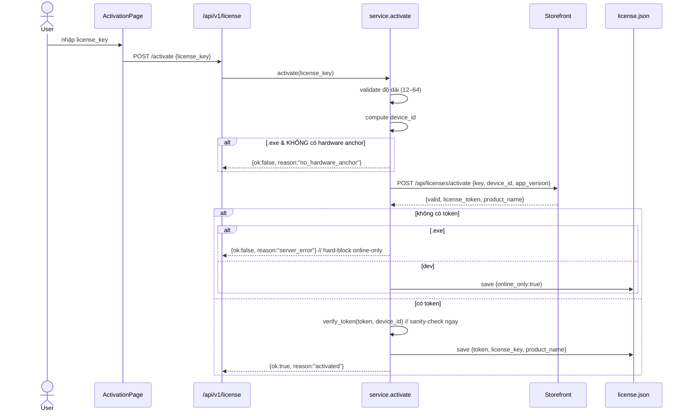
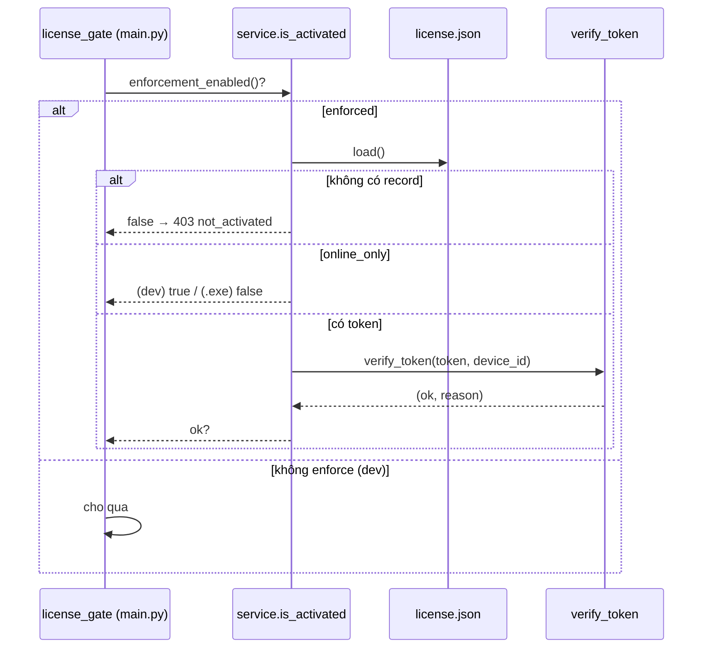

# License Verify & Activation Lifecycle (Contract)

> **Đây là tài liệu "hợp đồng" (contract).** Code trong `backend/app/license/` viện dẫn trực tiếp file này (ví dụ `device_id.py` tham chiếu **§4**). Các phần đánh dấu **FROZEN** đã được ship ra khách hàng — **không được đổi**, nếu đổi thì mọi máy đang hoạt động sẽ tính ra định danh/token khác và mất kích hoạt.
>
> Cập nhật: 2026-08-08.

Hệ thống bản quyền **node-locked, xác thực offline** dùng chữ ký **Ed25519**. Máy kích hoạt online **một lần** để lấy token đã ký, sau đó mọi lần mở app đều verify **offline**, không chạm mạng.

---

## 1. Thành phần

| File | Vai trò |
|------|---------|
| `backend/app/license/device_id.py` | Tính `device_id` (fingerprint phần cứng, cache theo tiến trình) |
| `backend/app/license/client.py` | HTTP client gọi storefront (`activate` / `verify`), map reason → tiếng Việt |
| `backend/app/license/token.py` | Verify token Ed25519 hoàn toàn offline; embed public key |
| `backend/app/license/store.py` | Lưu/đọc `license.json` trong data dir per-user |
| `backend/app/license/service.py` | Orchestrator: enforcement, activate, is_activated, get_status |
| `backend/app/api/license.py` | Router `/api/v1/license`: `status`, `activate`, `device` |
| `frontend/src/pages/ActivationPage.tsx` + `components/LicenseGate.tsx` | UI kích hoạt (gate bao trùm toàn app) |

Cấu hình liên quan (`app/config.py`): `LICENSE_SERVER_URL` (mặc định `https://storetoolmmo.com`), `LICENSE_TOKEN_GRACE_DAYS` (mặc định `0`), `LICENSE_ENFORCE` (mặc định `false`), `APP_VERSION`.

---

## 2. Enforcement (khi nào chặn)

`service.enforcement_enabled()`:
- **Luôn bật** trong bản đóng gói (`paths.is_frozen()` == True) → khách hàng **không thể tắt** bằng env var.
- Trong dev: chỉ bật khi `LICENSE_ENFORCE=true` (để dev không bị chặn).
- `--selftest` của `desktop.py` bật `_selftest_mode` **trong tiến trình** để smoke-test route bảo vệ; không có đường env/config nào để khách hàng kích hoạt cờ này.

**License gate** (`app/main.py`): middleware HTTP chặn mọi request `/api/v1/*` khi `enforcement_enabled()` và **chưa** `is_activated()`, **trừ** tiền tố `/api/v1/license` (để màn Activation gọi được backend). Trả `403 {reason: "not_activated"}`.

---

## 3. Lưu trữ (`license.json`)

Đặt tại `DATA_DIR/license.json` (per-user, sống qua restart / cài lại tool miễn `%LOCALAPPDATA%` còn). Bản ghi:

```jsonc
{
  "token": "<payloadB64url>.<signatureB64url>",  // token đã ký (verify offline)
  "license_key": "<mã kích hoạt>",
  "product_name": "<tên sản phẩm>"
}
```

Bản ghi **online-only** (server không có signing key → không có token) chỉ được chấp nhận **trong dev**; bản `.exe` **từ chối** (bắt buộc token đã ký):

```jsonc
{ "online_only": true, "license_key": "...", "product_name": "..." }
```

---

## 4. `device_id` — công thức (FROZEN)

> **Không được đổi input hay cách hash sau khi đã ship** — mọi khách hàng sẽ tính ra id mới và tiêu phí quota thiết bị.

```
raw       = machine_guid + "|" + bios_serial + "|" + system_disk_serial
device_id = sha256( lowercase(trim(raw)) )          # 64 hex chars
```

Nguồn từng thành phần (Windows):
- `machine_guid` — `HKLM\SOFTWARE\Microsoft\Cryptography\MachineGuid` (đọc view 64-bit, `KEY_WOW64_64KEY`). Anchor chính, ổn định nhất; chỉ đổi khi cài lại OS / thay phần cứng.
- `bios_serial` — `Win32_BIOS.SerialNumber` (PowerShell/CIM).
- `system_disk_serial` — serial của **đĩa vật lý chứa ổ C:** (`Get-Partition -DriveLetter C | Get-Disk`).

Quy ước:
- Thành phần nào đọc không được → thay bằng chuỗi literal **`"na"`** (giữ nguyên cấu trúc `a|b|c`, không co lại).
- **MAC address CỐ TÌNH không dùng** (đổi theo adapter Wi-Fi/USB/VPN).
- Kết quả cache theo vòng đời tiến trình (probe WMI/PowerShell chậm, spawn subprocess; giá trị không đổi lúc runtime).
- Non-Windows (dev/CI): fallback `platform.node()|na|na` để giữ shape ổn định theo host.

### Hardware anchor (chống lách VM)

`has_hardware_anchor()` = `bios_serial != "na"` **hoặc** `disk_serial != "na"`.

Khi **cả hai** đều `"na"` (thường gặp trên VM giấu serial), `device_id` co về `sha256(MachineGuid|na|na)` — mà `MachineGuid` là giá trị registry admin ghi đè được → mọi máy có cùng GUID giả sẽ ra cùng `device_id`, khiến `license.json` copy được và verify offline ở mọi nơi (mất node-lock).

→ **Activation từ chối** state này trong bản đóng gói (`service.activate` trả `reason: "no_hardware_anchor"`). Dev/CI non-Windows không bị chặn (serial luôn `na`).

---

## 5. Token format & verify (offline, FROZEN)

```
token = "<payloadB64url>.<signatureB64url>"
  payloadB64url   = base64url( JSON claims )
  signatureB64url = base64url( Ed25519 sign over the ASCII BYTES of payloadB64url )
```

> Chữ ký ký trên **ASCII bytes của chuỗi base64url payload**, KHÔNG phải trên JSON đã decode.

**Public key** embed cứng trong binary (`token.EMBEDDED_PUBLIC_KEY_PEM`, SPKI PEM Ed25519). Private key **chỉ ở server**. **Không bao giờ** fetch public key qua mạng (tránh key-swap). Đổi key này = vô hiệu mọi token đã cấp → phải giữ cố định suốt vòng đời sản phẩm. (Dev có thể override bằng `LICENSE_PUBLIC_KEY_PEM`/`LICENSE_PUBLIC_KEY_FILE` để test với storefront staging; bản frozen bỏ qua override.)

`verify_token(token, expected_device_id)` → `(ok, reason, claims)`, kiểm tra theo thứ tự:
1. **Chữ ký** hợp lệ (chống giả mạo/forge) — sai → `reason="bad_signature"`.
2. **Node lock**: `claims.device_id` == `expected_device_id` — sai → `reason="device_mismatch"`.
3. **Hạn dùng**: `claims.grace_expires_at` phải ở tương lai — quá hạn → `reason="expired"`. Với `GRACE_DAYS=0`, `grace_expires_at` = `license_expires_at` (rất xa → coi như không hết hạn).

`reason` khác: `""` (ok), `"malformed"`.

Claims tối thiểu (server phát hành): `device_id`, `grace_expires_at` (và các trường khác như `license_expires_at`, `product_name`...).

---

## 6. Storefront API (chỉ gọi khi activate / refresh grace)

`client.activate(license_key, device_id)` → `POST {LICENSE_SERVER_URL}/api/licenses/activate`
```jsonc
// request
{ "license_key": "...", "device_id": "<64 hex>", "app_version": "1.0.0" }
// response 200 khi hợp lệ
{ "valid": true, "reason": "activated", "license_token": "<token>", "product_name": "...", ... }
```

`client.verify(license_key, device_id?)` → `POST /api/licenses/verify` — chỉ dùng khi **grace mode** (`GRACE_DAYS>0`) cần refresh token đã hết hạn.

Map mã lỗi server → thông báo tiếng Việt (`client._ERROR_MESSAGES`): `license_not_found`, `order_not_paid`, `revoked`, `device_limit_reached`, `device_not_activated`, `rate_limited`, `network`, `server_error`, `bad_request`. HTTP 429→`rate_limited`, 403→`revoked` (hoặc reason server), 400→`bad_request`, ≥500→`server_error`.

---

## 7. Lifecycle

### 7.1. Activate (online, một lần)



### 7.2. Mỗi lần mở app (offline)



---

## 8. Bất biến (Invariants) — đọc trước khi sửa

- **§4 device_id** và **§5 token format / public key** là FROZEN — đổi = mất kích hoạt hàng loạt.
- Bản `.exe` **luôn** enforce và **luôn** đòi token đã ký (từ chối online-only).
- Public key embed trong binary, **không** fetch mạng.
- Verify offline mỗi lần mở; chỉ chạm mạng khi activate (hoặc refresh grace nếu `GRACE_DAYS>0`).
- MAC không nằm trong device_id; thành phần thiếu = `"na"`, không co cấu trúc.
- Route `/api/v1/license/*` là các endpoint duy nhất reachable trước khi kích hoạt.
